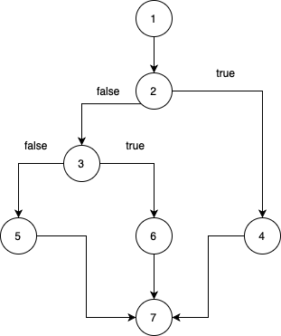
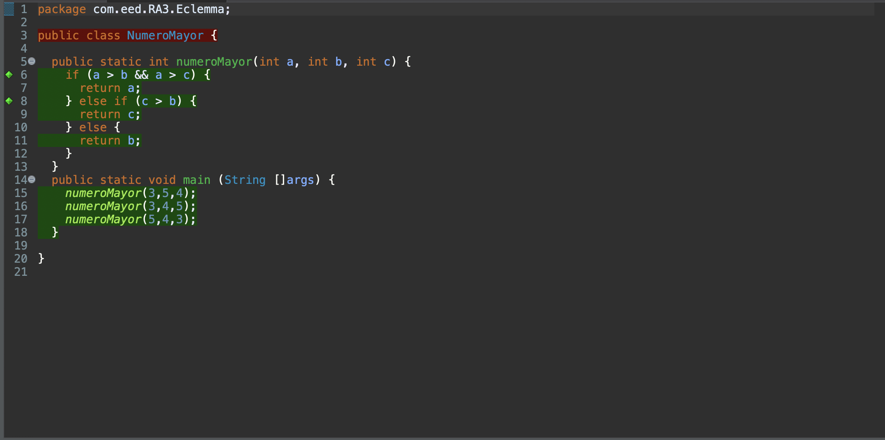

## Eclemma Recuperacion
* 1. Grafo del flujo del programa. 
 
* 2. Complejidad ciclomática. 
Complejidad ciclomática = Aristas - Nodos + 2  
Complejidad ciclomática = 8 - 7 + 2 = 3  
* 3. Caminos independientes. 
El primer camino seria que a fuera menor que b y c, y b mayor que c. Valores a = 3, b = 5, c = 4. 
El primer camino seria que a fuera menor que b y c, y c mayor que b. Valores a = 3, b = 4, c = 5. 
El tercer camino que a fuera mayor que b y c. Valores a = 5, b = 4, c = 3. 
* 4. Pantallazo de la vista Coverage con el 100% de cobertura en los métodos implicados (herramienta Eclemma). 
 
* 5. Enlace al codigo.  
[NumeroMayor](../NumeroMayor.java) 
