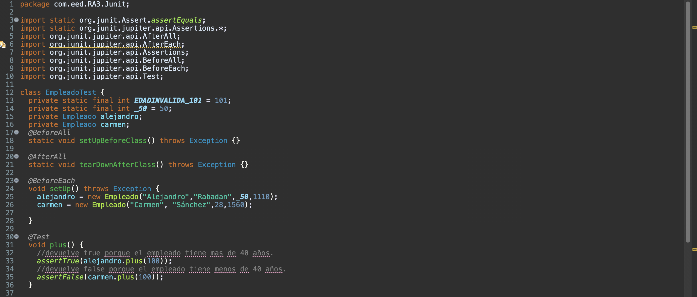
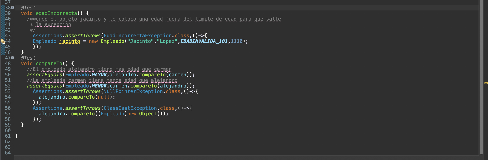
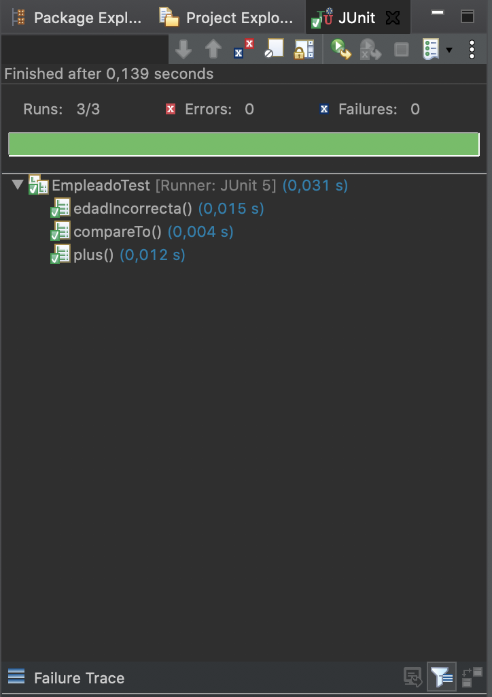

## Junit Recuperacion
* 1. Imágenes de los métodos. 
 
 
* 2. Chequeo de los métodos test Junit. 
 
* 3. Enlace al codigo.  
[EmpleadoTest](../EmpleadoTest.java) 
[Empleado](../Empleado.java) 
[EdadIncorrectaException](../EdadIncorrectaException.java)

